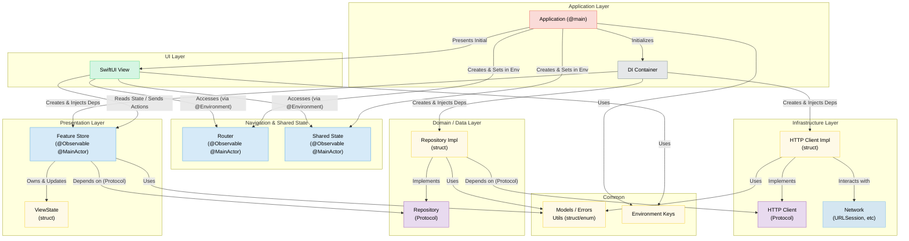

# ObservationStore-SwiftUI

```mermaid
graph TD
    %% Changed graph direction to Top-Down
    %% --- Title ---
    %% title Observation Store Pattern - Architecture Diagram (TD Layout)

    %% --- Core Components / Layers ---

    subgraph "Application Layer"
        App["Application (@main)"]
        DI["DI Container"]
    end

    subgraph "UI Layer"
        View["SwiftUI View"]
    end

    subgraph "Presentation Layer"
        Store["Feature Store<br>(@Observable @MainActor)"]
        State["ViewState<br>(struct)"]
    end

    subgraph "Navigation & Shared State"
        %% direction RL has no effect in TD, removed/ignored
        Router["Router<br>(@Observable @MainActor)"]
        SharedState["Shared State<br>(@Observable @MainActor)"]
    end

    subgraph "Domain / Data Layer"
        %% direction RL has no effect in TD, removed/ignored
        RepoProto["Repository<br>(Protocol)"]
        RepoImpl["Repository Impl<br>(struct)"]
    end

    subgraph "Infrastructure Layer"
       %% direction RL has no effect in TD, removed/ignored
       HttpClientProto["HTTP Client<br>(Protocol)"]
       HttpClientImpl["HTTP Client Impl<br>(struct)"]
       Network["Network<br>(URLSession, etc)"]
    end

    subgraph "Common"
       ModelsErrorsUtils["Models / Errors<br>Utils (struct/enum)"]
       EnvironmentKeys["Environment Keys"]
    end

    %% --- Interactions & Dependencies ---

    %% Setup Flow
    App -- Initializes --> DI
    App -- Creates & Sets in Env --> Router
    App -- Creates & Sets in Env --> SharedState
    App -- Presents Initial --> View

    %% UI Interaction Flow (Dependencies adjusted for TD)
    View -- Reads State / Sends Actions --> Store
    View -- Accesses (via @Environment) --> Router
    View -- Accesses (via @Environment) --> SharedState
    Store -- Owns & Updates --> State

    %% Data Flow (Dependencies adjusted for TD)
    Store -- Depends on (Protocol) --> RepoProto
    RepoImpl -- Implements --> RepoProto
    RepoImpl -- Depends on (Protocol) --> HttpClientProto
    HttpClientImpl -- Implements --> HttpClientProto
    HttpClientImpl -- Interacts with --> Network

    %% Common Usage
    Store -- Uses --> ModelsErrorsUtils
    RepoImpl -- Uses --> ModelsErrorsUtils
    HttpClientImpl -- Uses --> ModelsErrorsUtils
    View -- Uses --> EnvironmentKeys
    App -- Uses --> EnvironmentKeys


    %% Dependency Injection Flow
    DI -- Creates & Injects Deps --> Store
    DI -- Creates & Injects Deps --> RepoImpl
    DI -- Creates & Injects Deps --> HttpClientImpl
    %% DI also creates Router & SharedState instances passed by App

    %% --- Styling (Optional) --- Setting text color to black (#000000) ---
    classDef observable fill:#D6EAF8,stroke:#5DADE2,stroke-width:1px,color:#000000
    classDef protocol fill:#E8DAEF,stroke:#A569BD,stroke-width:1px,color:#000000
    classDef view fill:#D5F5E3,stroke:#58D68D,stroke-width:1px,color:#000000
    classDef impl fill:#FEF9E7,stroke:#F4D03F,stroke-width:1px,color:#000000
    classDef app fill:#FADBD8,stroke:#EC7063,stroke-width:1px,color:#000000
    classDef di fill:#E5E7E9,stroke:#839192,stroke-width:1px,color:#000000
    classDef infra fill:#D4E6F1,stroke:#85C1E9,stroke-width:1px,color:#000000

    %% Applying styles individually
    class Store observable
    class Router observable
    class SharedState observable
    class RepoProto protocol
    class HttpClientProto protocol
    class View view
    class RepoImpl impl
    class HttpClientImpl impl
    class State impl
    class ModelsErrorsUtils impl
    class EnvironmentKeys impl
    class App app
    class DI di
    class Network infra
```
